# Cardio Catch Diseases Prediction

# Business Problem

Cadio Catch Diseases is a company specialized in detecting heart disease in the early stages. The company is in the Service Business, which offers an early diagnosis of a cardiovascular disease for a certain price.

Currently, the cardiovascular disease diagnosis is manually, by a specialists team. The diagnosis current accuracy lies between 55% and 65%, due to the complexity of the diagnosis and also the team fatigue, who take turns to minimize the risks. The cost of each diagnosis, including the devices and the analysts payroll, is R$ 1,000.00.

The diagnosis price, paid by the client, varies depending on the precision achieved by the specialists team. The client pays R$ 500,00 for each 5% accuracy above 50%. For example, for a 55% accuracy, the diagnosis costs R$ 500.00 for the client, for a 60% accuracy, the price is R$ 1000.00 and so on. If the diagnostic accuracy is 50%, its free of charge.

As we see, the diagnosis acurracy deviation make the CCD company diagnosis either a profitable operation or a unprofitable operation. This diagnosis ROI creates an unpredictable revenue for the CCD company.

# Objective and Solution Proposal

### Objective

Increment the Cardio Catch Diseases company (CCD) profit. By increase the diagnostics tests precision and stability.

### Solution Proposal

Create a binary classification toll with statics model and machine learning to increase the diagnostics tests precision and stability.

# Dataset Summary

- **`id`** - [int]: Patients ID register in the system
- **`age`** - [int]: Patients age in days 
- **`height`** - [float]: Patients height in cm
- **`weight`** - [float]: Patients weight in kg
- **`gender`** - [binary]: Patients gender
- **`ap_hi`** - [float]: Patients diastolic blood pressure
- **`ap_lo`** - [float]: Patients diastolic blood pressure
- **`cholesterol`** - [categorical]: Patients cholesterol level
- **`gluc`** - [categorical]: Patients glucose level
- **`smoke`** - [binary]: Check if Patients is a smoker
- **`alco`** - [binary]: Check if Patients is a drinker
- **`active`** - [binary]: Check if patients practices physical activities
- **`cardio`** - [binary]: Check if patients practices has cardiovascular diseases

#  Mind Map Hypoteses

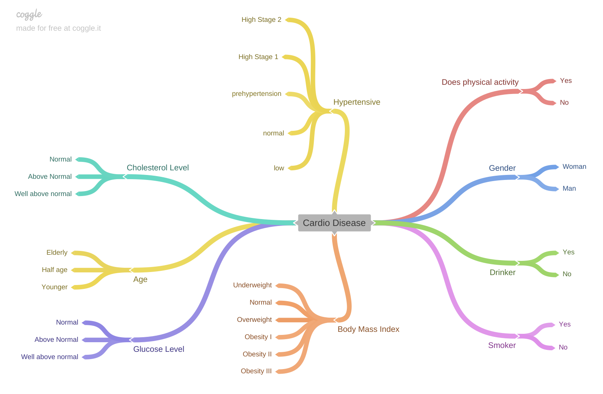

# Exploratory Data Analysis

## Univariate Analysis

### Categorical Features Distribution Analysis

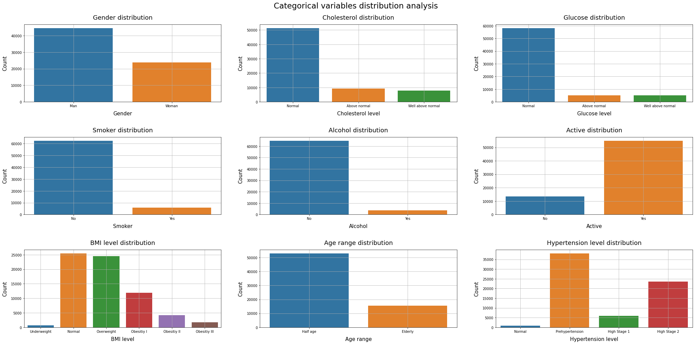 

- Most of the patients are woman.
- Most of the patients have a normal cholesterol level.
- Most of the patients have a normal glucose level.
- Most of the patients are a non smoker person.
- Most of the patients are a non drinker person.
- Most of the patients practice a physical activity.
- Most of the patients have a normal or a overweight BMI level.
- There are no younger patients.
-  Most of the patients are a half age person.
- Most of the patients have a prehypertension hypertension level.

### Numerical Features Distribution Analysis

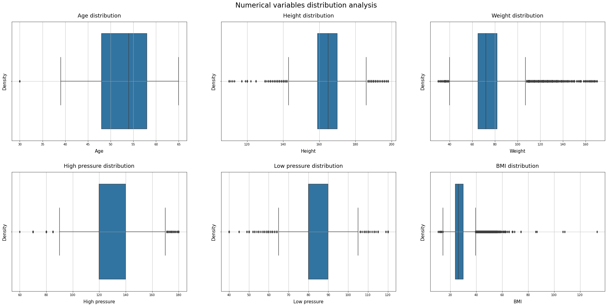 

All numerical variables have a large number of outliers yet, except the **`age`** feature.

## Bivariate Analysis

### Hypothesis 1: Chances of having Heart diseases increases by being a man

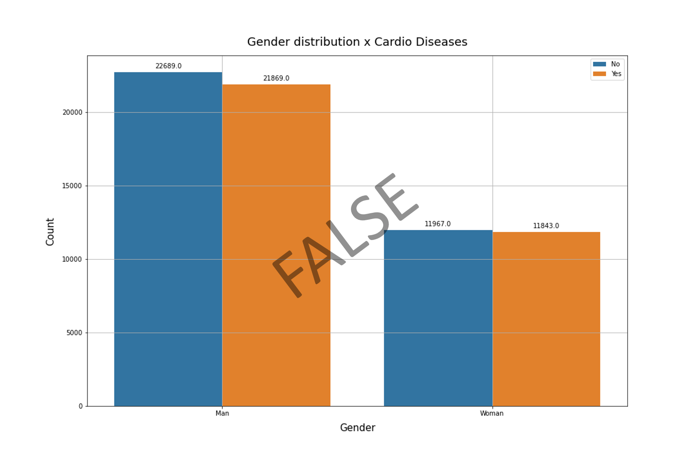 

The proportion between sick and healthy men compared to the proportion between sick and healthy women are almost the same.

### Hypothesis 2: Chances of having Heart diseases increases by increase the Body Mass Index

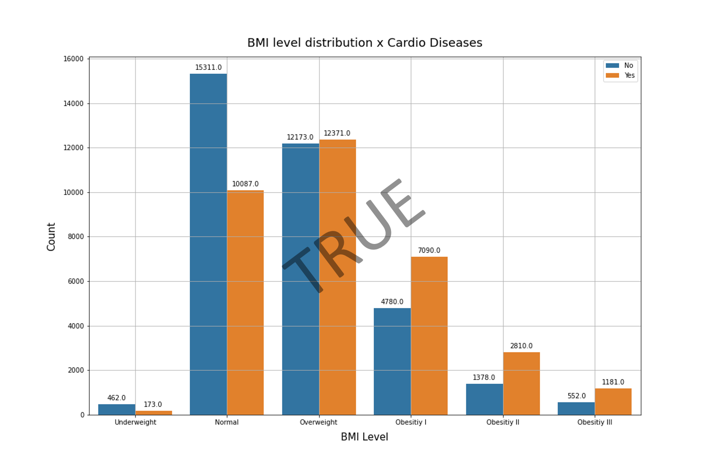 

The proportion between sick and healthy people increase with the BMI Level growth.

### Hypothesis 3: Chances of having Heart diseases increases by increase the Cholesterol level

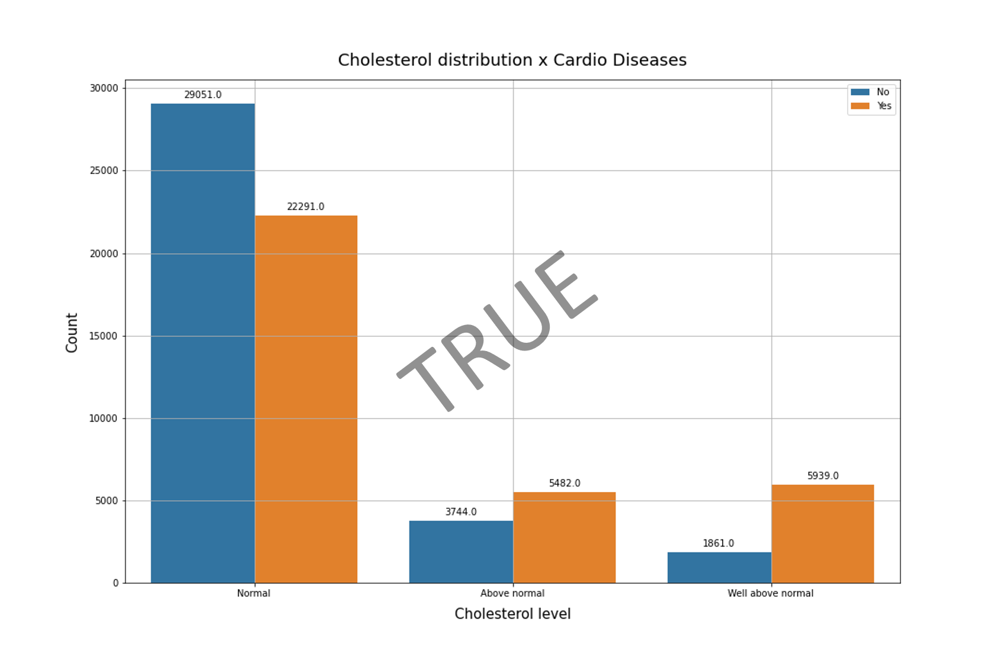 

The proportion between sick and healthy people increase with the Cholesterol Level growth.

### Hypothesis 4: Chances of having Heart diseases increases by increase the Glucose level

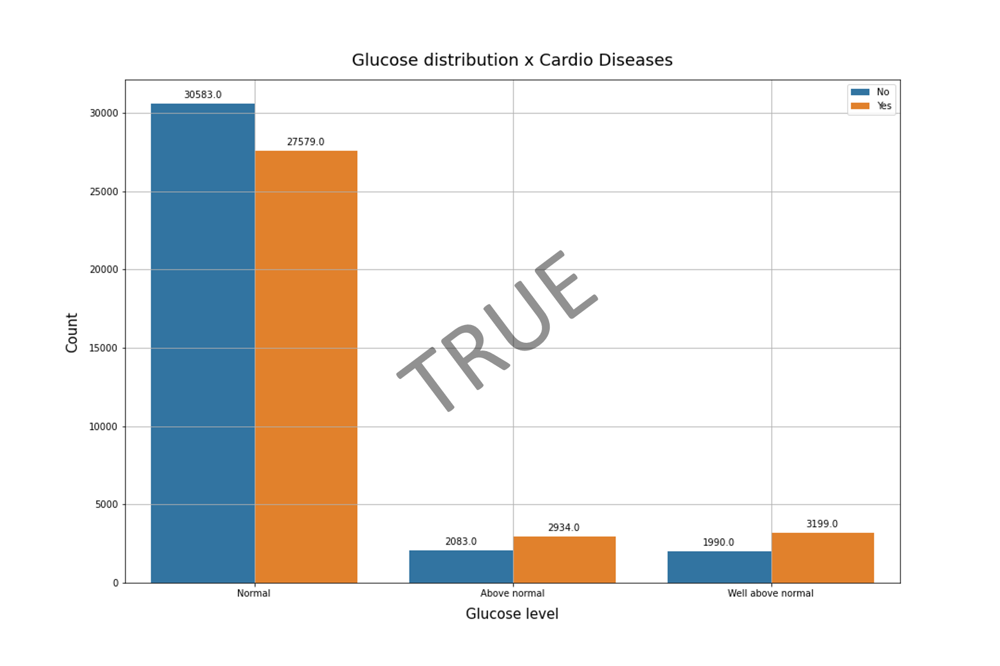 

The proportion between sick and healthy people increase with the Glucose Level growth.

### Hypothesis 5: Chances of having Heart diseases increases by being a smoker

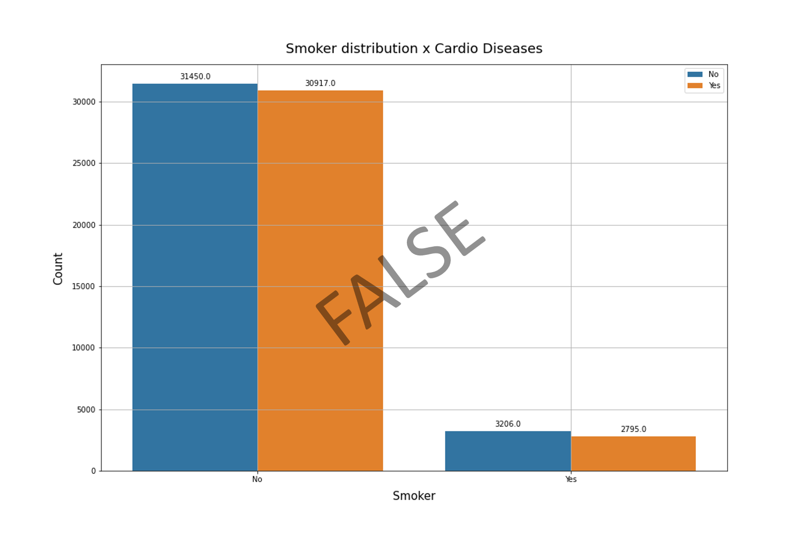 

The proportion between sick and healthy non smokers compared to the proportion between sick and healthy smokers are almost the same.

### Hypothesis 6: Chances of having Heart diseases increases by intake alcohol through life

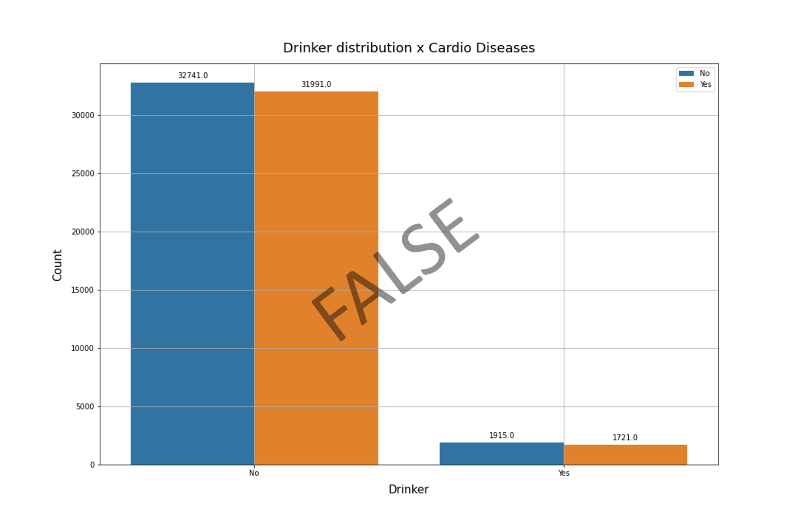 

The proportion between sick and healthy non drinkers compared to the proportion between sick and healthy drinkers are almost the same.

### Hypothesis 7: Chances of having Heart diseases decreases by being an active person through life

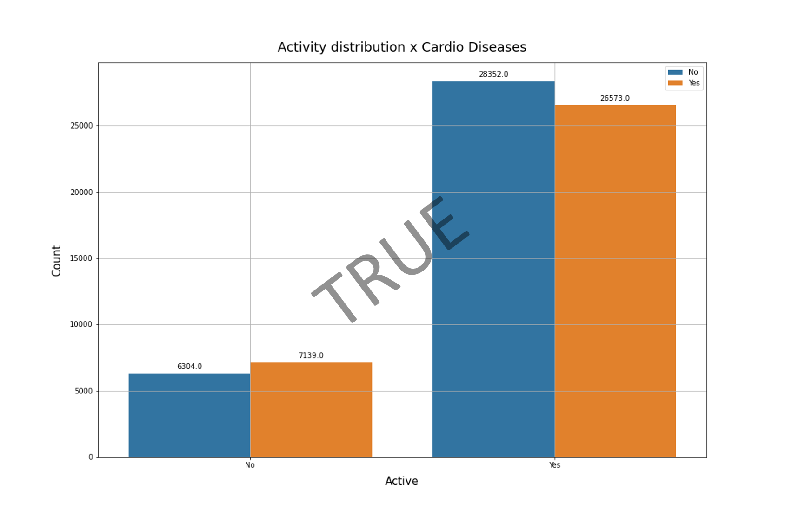 

The proportion between sick and healthy non sportists compared to the proportion between sick and healthy sportists is lower.

### Hypothesis 8: Chances of having Heart diseases increases by being an older person

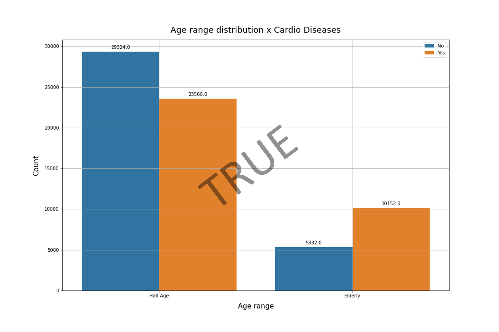 

The proportion between sick and healthy people increase with the Age Range Level growth.

### Hypothesis 9: Chances of having Heart diseases increases by being hypertensive person

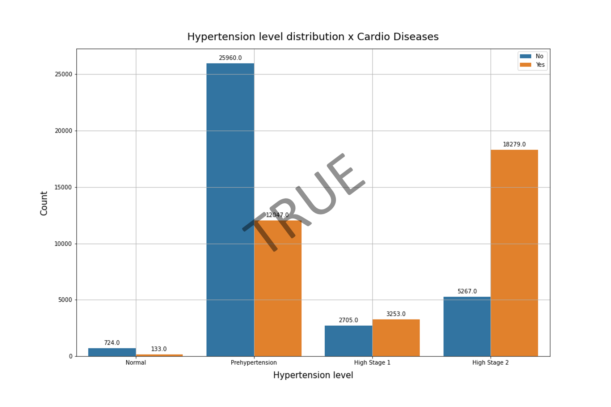 

The proportion between sick and healthy people increase with the Hypertension Level growth.

### Hypothesis 10: Chances of having Heart diseases is higher between hypertensive elderly people than general hypertensive people

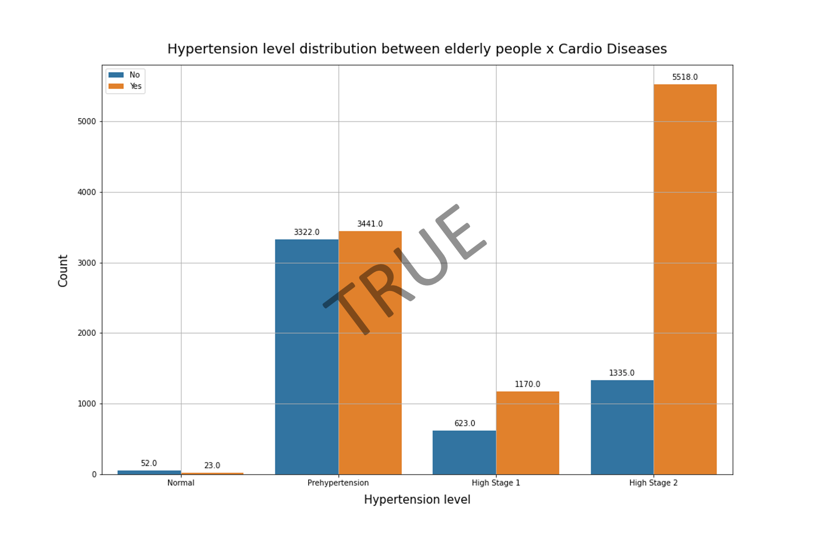 

Between elderlies, the proportion between sick and healthy people increase with the Hypertension Level growth
This increase exponentially higher than the increase between people in general.
Prehypertense elderlies are more likely to have cardiovascular diseases than prehypertense people in general.

## Multivariate Analysis

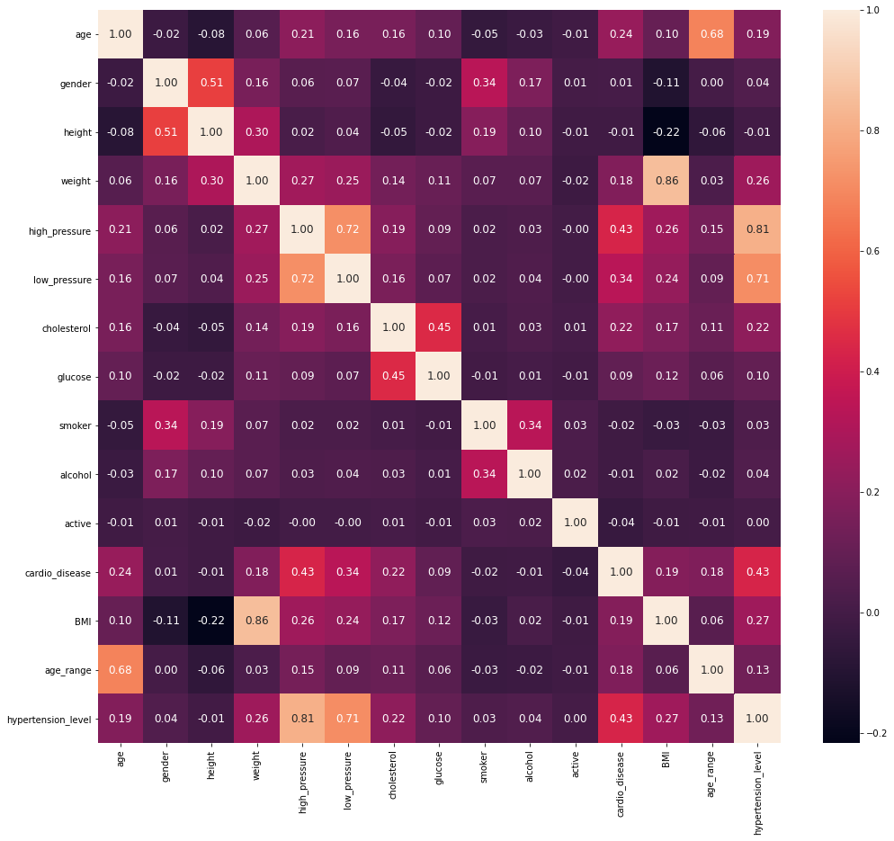 

**There are some variables that have considerable impact over 'cardio_disease' result values:**

- **`high_pressure`**
- **`hypertension_level`**
- **`low_pressure`**
- **`age`**
- **`cholesterol`**
- **`BMI`**
- **`age_range`**
- **`weight`**

# Machine Learning Models Testing

To start, the following machine learning models were tested:

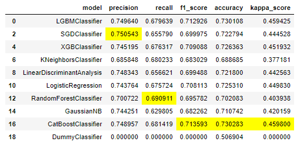 

- **On the business side:** We are aiming Precision score. Because each 5% increases on it is a R$ 500 increase in the diagnosis test price.
- **On the patient side:** We are aiming Recall score. Because it reduces the chance of having a False Negative test result. As we know, false negatives results, frequently, comforts people into not retest. And in this case, there will be people with a growing disease that they don't know.

So, we will choose the Top 4 best F1 Score models above to analyze, which is a metric that takes into account the Precision and the Recall metrics.

# Proposed Machine Learning Model

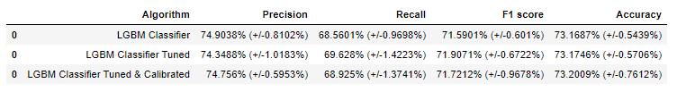

- All LGBM models have almost the same metrics, in general.
- Taking in account that the LGBM Default model have a lower Recall and lower F1 score than the others, it will be cut out, thinking about the patients interests.
- Taking in account that the LGBM Tuned & Calibrated model have a lower Precision and Recall intervals than the LGBM Tuned model, it will be cut out, thinking about the patients interests.

So, **we will choose the LGBM Tuned as the final model to propose.**

**OBS:** For more about the decisions made and how it was done: [Cardio Catch Diseases notebook](https://github.com/pedrofratucci/Cardio_Catch_Diseases/blob/main/notebooks/cardio_catch_deseases_PH.ipynb)

# Business Solution Performance

## Business Precision Methods Comparison

### Actual Business Method Precision

The diagnosis test is processed through a manual analysis, by a specialists team.
It depends on the precision achieved by the team and on properly working devices. Which causes a significant precision deviance.

**Precision Interval Achieved: 55% to 65%**

### Proposed Business Method Precision

The diagnosis test is processed through an automatic analysis, independent on human analysis.

It depends on the machine learning algorithm running on a cloud plataform. This algorithm implementaion generates a small precision deviance.

**Precision Interval Achieved: 73,33% to 75,37%**

## Business Revenue Methods Comparison

### Actual Business Diagnosis Test Profit

Taking the considerable precision deviance and range, it creates an unpredictable revenue, with positive and negative resulting scenarios.

It takes a R$ 1,000.00 price cost, which includes the specialists team payment and operation devices cost.

**Worst Scenario: - R$ 500.00**
 
**Best Scenario:    R$ 500.00** 

### Proposed Business Diagnosis Test Profit

Taking in account the small precision deviance and range, compared to the actual business method, it still creates an unpredictable revenue as well, buy only with positive resulting scenarios.

Taking both cases best scenarios in comparison, we have a 400% revenue increase.

**Worst Scenario: R$ 2,000.00**
 
**Best Scenario:  R$ 2,500.00** 

  
# Model Deploy

The model application can be found here:
 - https://cardio-catch-diseases-ph.herokuapp.com/

# Further Improvements

Optimize the machine learning model precision interval for values over 75%, so the diagnosis test price always remain R$ 2.500,00 so we can have a predictable revenue.

# Referencess

## Business Problem Source
- https://sejaumdatascientist.com/projeto-de-data-science-diagnostico-precoce-de-doencas-cardiovasculares/

## Data Source
- https://www.kaggle.com/sulianova/cardiovascular-disease-dataset

## Supplementary Materials
- https://www.medicalnewstoday.com/articles/327178#categories
